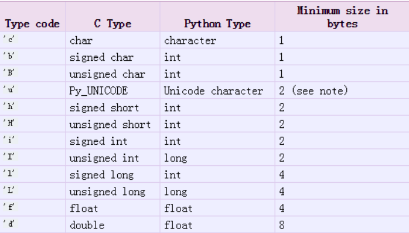
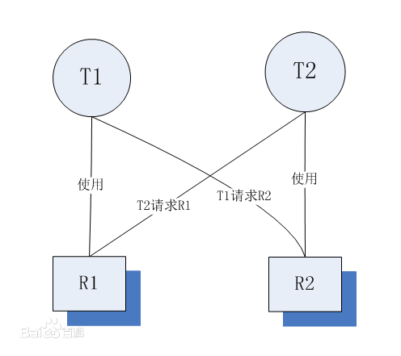

并发编程
==========================

| Tedu Python 教学部 |
| --- |
| Author：吕泽|

-----------

[TOC]

## 多任务编程

1. 意义： 充分利用计算机CPU的多核资源，同时处理多个应用程序任务，以此提高程序的运行效率。

2. 实现方案 ：多进程 ， 多线程


## 进程（process）

### 进程理论基础

1. 定义 ： 程序在计算机中的一次运行。
>* 程序是一个可执行的文件，是静态的占有磁盘。
>* 进程是一个动态的过程描述，占有计算机运行资源，有一定的生命周期。


2. 系统中如何产生一个进程
		  【1】 用户空间通过调用程序接口或者命令发起请求
			【2】 操作系统接收用户请求，开始创建进程
			【3】 操作系统调配计算机资源，确定进程状态等
			【4】 操作系统将创建的进程提供给用户使用


		
3. 进程基本概念

* cpu时间片：如果一个进程占有cpu内核则称这个进程在cpu时间片上。

* PCB(进程控制块)：在内存中开辟的一块空间，用于存放进程的基本信息，也用于系统查找识别进程。
	
* 进程ID（PID）： 系统为每个进程分配的一个大于0的整数，作为进程ID。每个进程ID不重复。
	
	>Linux查看进程ID ： ps -aux
	
* 父子进程 ： 系统中每一个进程(除了系统初始化进程)都有唯一的父进程，可以有0个或多个子进程。父子进程关系便于进程管理。
	
>查看进程树： pstree

* 进程状态

	- 三态  
		就绪态 ： 进程具备执行条件，等待分配cpu资源
		运行态 ： 进程占有cpu时间片正在运行
		等待态 ： 进程暂时停止运行，让出cpu


  - 五态 (在三态基础上增加新建和终止)
		新建 ： 创建一个进程，获取资源的过程
		终止 ： 进程结束，释放资源的过程


  - 状态查看命令 ： ps -aux  --> STAT列

>				S 等待态
>R 执行态
>Z 僵尸

>				`+` 前台进程
>l   有多线程的

* 进程的运行特征
	【1】 多进程可以更充分使用计算机多核资源
	【2】 进程之间的运行互不影响，各自独立
	【3】 每个进程拥有独立的空间，各自使用自己空间资源

>面试要求
>>1. 什么是进程，进程和程序有什么区别
>>2. 进程有哪些状态，状态之间如何转化


## 基于fork的多进程编程

### fork使用

***代码示例：day7/fork.py***


****

```
"""
fork.py  fork进程创建演示
"""
import os
from time import sleep

# 创建子进程
pid = os.fork()

if pid < 0:
    print("Create process failed")
elif pid == 0:
    # 只有子进程执行
    sleep(3)
    print("The new process")
else:
    # 只有父进程执行
    sleep(4)
    print("The old process")

# 父子进程都执行
print("process test over")
```

**代码示例：day7/fork1.py***


```
"""
fork1.py fork进程演示细节
"""

import os
from time import sleep

print("=========================")
a = 1
def fun():
    print("fun .... ")

pid = os.fork()

if pid < 0:
    print("Create process failed")
elif pid == 0:
    print("Child process")
    print("a = ",a)  # 从父进程空间拷贝了变量
    fun()
    a = 10000  # 只是修改了自己空间的a
else:
    sleep(1)
    print("Parent process")
    print("a:",a)

print("All a ->",a)
```


> pid = os.fork()
		功能： 创建新的进程
		返回值：整数，如果创建进程失败返回一个负数，如果成功则在原有进程中返回新进程的PID，在新进程中返回0

>注意
>>* 子进程会复制父进程全部内存空间，从fork下一句开始执行。
>>* 父子进程各自独立运行，运行顺序不一定。
>>* 利用父子进程fork返回值的区别，配合if结构让父子进程执行不同的内容几乎是固定搭配。
>>* 父子进程有各自特有特征比如PID PCB 命令集等。
>>* 父进程fork之前开辟的空间子进程同样拥有，父子进程对各自空间的操作不会相互影响。

### 进程相关函数

***代码示例：day7/get_pid.py***

```
"""
获取进程PID号
"""

import os
from time import sleep

pid = os.fork()

if pid < 0:
    print("Error")
elif pid == 0:
    sleep(1)
    print("Child PID:",os.getpid()) # 自己pid
    print("Get parent PID:",os.getppid()) # 父pid
else:
    print("Parent PID:", os.getpid())  # 自己pid
    print("Get child PID:",pid)

```

***代码示例：day7/exit.py***

```
"""
进程退出演示
"""

import os,sys

pid = os.fork()

# 父子进程退出不会影响对方继续执行
if pid < 0:
    print("Error")
elif pid == 0:
    # os._exit(0) # 子进程退出
    print("Child process")
else:
    sys.exit("退出父进程")
    print("Parent process")
```


>os.getpid()
			功能： 获取一个进程的PID值
			返回值： 返回当前进程的PID 

>os.getppid()
			功能： 获取父进程的PID号
			返回值： 返回父进程PID

>os._exit(status)
			功能: 结束一个进程
			参数：进程的终止状态

>sys.exit([status])
			功能：退出进程
			参数：整数 表示退出状态
						字符串 表示退出时打印内容

### 孤儿和僵尸

1. 孤儿进程 ： 父进程先于子进程退出，此时子进程成为孤儿进程。

>特点： 孤儿进程会被系统进程收养，此时系统进程就会成为孤儿进程新的父进程，孤儿进程退出该进程会自动处理。

2. 僵尸进程 ： 子进程先于父进程退出，父进程又没有处理子进程的退出状态，此时子进程就会称为僵尸进程。

>特点： 僵尸进程虽然结束，但是会存留部分PCB在内存中，大量的僵尸进程会浪费系统的内存资源。

3. 如何避免僵尸进程产生


  * 使用wait函数处理子进程退出

  ***代码示例：day7/wait.py***

```
"""
模拟僵尸进程产生
"""

import os,sys
import signal

# 忽略子进程的退出行为，子进程退出自动由系统处理
signal.signal(signal.SIGCHLD,signal.SIG_IGN)

pid = os.fork()
if pid < 0:
    print("Error")
elif pid == 0:
    print("Child PID:",os.getpid())
    sys.exit(2)
else:
    """
    os.wait() 处理僵尸
    """
    # pid,status = os.wait()
    # print("pid:",pid)
    # print('status:',os.WEXITSTATUS(status))
    while True: # 让父进程不退出
        pass
```


		```		
		pid,status = os.wait()
		功能：在父进程中阻塞等待处理子进程退出
		返回值： pid  退出的子进程的PID
			status  子进程退出状态
		
		```


   * 创建二级子进程处理僵尸

   * 

   * 

		***代码示例：day7/child.py***

	```
	"""
	创建二级子进程处理僵尸
	"""
	import os
	from time import sleep
	
	def f1():
	    for i in range(3):
	        sleep(2)
	        print("写代码")
	
	def f2():
	    for i in range(2):
	        sleep(4)
	        print("测代码")
	
	pid = os.fork()
	if pid == 0:
	    p = os.fork()  # 创建二级子进程
	    if p == 0:
	        f1()
	    else:
	        os._exit(0)  # 一级子进程退出
	else:
	    os.wait()  # 等待回收一级子进程
	    f2()
	```
	
	【1】 父进程创建子进程，等待回收子进程
	【2】 子进程创建二级子进程然后退出
	【3】 二级子进程称为孤儿，和原来父进程一同执行事件


  * 通过信号处理子进程退出
				
	>原理： 子进程退出时会发送信号给父进程，如果父进程忽略子进程信号，则系统就会自动处理子进程退出。

	>方法： 使用signal模块在父进程创建子进程前写如下语句 ：
	```python
	import signal
	signal.signal(signal.SIGCHLD,signal.SIG_IGN)
	```

	>特点 ： 非阻塞，不会影响父进程运行。可以处理所有子进程退出


### 群聊聊天室 

>功能 ： 类似qq群功能
	【1】 有人进入聊天室需要输入姓名，姓名不能重复
	【2】 有人进入聊天室时，其他人会收到通知：xxx 进入了聊天室
	【3】 一个人发消息，其他人会收到：xxx ： xxxxxxxxxxx
	【4】 有人退出聊天室，则其他人也会收到通知:xxx退出了聊天室
	【5】 扩展功能：服务器可以向所有用户发送公告:管理员消息： xxxxxxxxx

聊天室程序思路：

1. 需求分析 ：  达到什么样的目的，形成什么样的运行流程

    * 启动软件--> 输入姓名-->进入-->聊天（收发随意）-> 退出
             |    |
             ---不允许进入

2. 技术点的确定

   * 消息发送流程： client-->server->client

   * 网络选择 ： udp 进行数据传输

   * 存储内容： name  address
     {name:address,}
     [(name,address),]

   * 消息收发互不影响

     使用多进程，让消息发送接收各占一个进程

3. 结构和注意事项

   * 采用什么结构封装 ： 函数
   * 编写一个功能，测试一个功能
   * 注释

4. 功能模块分析

   * 网络搭建
        客户端 ： udp客户端
        服务端 ： udp服务端

   * 进入聊天室
        客户端 ： * 输入姓名
                 * 向服务器发送请求
                 * 接收结果
                 * 允许则进入聊天，不允许则重写输入姓名

        服务器 ： * 接受请求，区分请求类型
                 * 判断用户是否存在
                 * 如果允许进入，将其加入存储结构
                 * 通知其他用户，告知本人可以登录
                 * 如果不允许则结束，告知用户不可以进入

   * 聊天
        客户端 ： * 创建新的进程
                * 一个进程循环的发送消息
                * 一个进程循环的接收消息

        服务端 ： * 接收请求，判断请求类型
                 * 将消息转发给其他用户
                   xxx : xxxxxxxxx

   * 退出聊天室
        客户端 ： * 输入quit 或者 ctrl-c退出
                * 发送请求给服务端
                * 结束进程
        服务端 ： * 接收请求，判断请求类型
                 * 将退出消息发送给其他人
                 * 将用户从字典删除

   * 管理员消息

5. 协议设定

     请求格式：
        登录 ：  L name
        聊天 ：  C name text
        退出 ：  Q name

     响应格式：
        登录 ： 成功（OK） 失败（失败原因）
        退出 ： 给客户端发送 EXIT 让客户端接收进程退出

```
"""
chat room 客户端
发送请求，展示结果
"""

from socket import *
import os,sys

# 服务器地址
ADDR = ('127.0.0.1',8888)

# 进入聊天室
def login(s):
    while True:
        try:
            name = input("请输入昵称:")
            if not name:
                continue
        except KeyboardInterrupt:
            sys.exit("谢谢使用")
        msg = "L " + name
        s.sendto(msg.encode(),ADDR)
        #　接收反馈结果
        data,addr = s.recvfrom(128)
        if data.decode() == 'OK':
            print("您已进入聊天室")
            return name
        else:
            print(data.decode())

# 子进程函数
def send_msg(s,name):
    while True:
        try:
            text = input("头像:")
        except KeyboardInterrupt:
            text = 'quit'
        # 退出聊天室
        if text.strip() == 'quit':
            msg = "Q " + name
            s.sendto(msg.encode(),ADDR)
            sys.exit('退出聊天室')
        msg = "C %s %s"%(name,text)
        s.sendto(msg.encode(),ADDR)

def recv_msg(s):
    while True:
        data,addr = s.recvfrom(2048)
        # 接收进程退出
        if data.decode() == 'EXIT':
            sys.exit()
        print(data.decode()+'\n头像:',end='')

# 客户端启动函数
def main():
    s = socket(AF_INET,SOCK_DGRAM)
    name = login(s) # 请求进入聊天室

    # 创建新的进程
    pid = os.fork()
    if pid < 0:
        print("Error!!")
        return
    elif pid == 0:
        send_msg(s,name)  # 子进程发送消息
    else:
        recv_msg(s)  # 父进程接收消息

main()

```

```
"""
chat room
env: python3.6
socket udp & fork
"""
from socket import *
import os,sys

# 服务端地址
ADDR = ('0.0.0.0',8888)
# 存储用户的结构 {name:address}
user = {}

# 处理登录
def do_login(s,name,addr):
    if name in user or '管理员' in name:
        s.sendto("该用户存在".encode(),addr)
        return

    # 加入用户
    msg = "\n欢迎 %s 进入聊天室"%name
    for i in user:
        s.sendto(msg.encode(),user[i])
    user[name] = addr
    s.sendto(b'OK',addr)

# 聊天
def do_chat(s,name,text):
    msg = "\n%s: %s"%(name,text)
    for i in user:
        # 刨除本人
        if i != name:
            s.sendto(msg.encode(),user[i])

# 退出
def do_quit(s,name):
    msg = "\n%s 退出聊天室"%name
    for i in user:
        if i != name:  #  其他人
            s.sendto(msg.encode(),user[i])
        else:
            s.sendto(b'EXIT',user[i])
    del user[name]  # 删除该用户


# 接受请求，分发给不同方法处理
def do_request(s):
    while True:
        # 循环接收来自客户端请求
        data,addr = s.recvfrom(1024)
        tmp = data.decode().split(' ',2)
        # 根据不同的请求类型分发函数处理
        # L 进入  C 聊天 Q退出
        if tmp[0] == 'L':
            do_login(s,tmp[1],addr)
        elif tmp[0] == 'C':
            do_chat(s,tmp[1],tmp[2])
        elif tmp[0] == 'Q':
            if tmp[1] in user:
                do_quit(s, tmp[1])

# 搭建网络
def main():
    # udp服务端
    s = socket(AF_INET,SOCK_DGRAM)
    s.bind(ADDR)

    # 开辟新的进程处理管理员消息
    pid = os.fork()
    if pid == 0:
        # 子进程处理管理员消息
        while True:
            msg = input("管理员消息:")
            msg = "C 管理员 " + msg
            s.sendto(msg.encode(),ADDR)
    else:
        do_request(s) # 处理客户端请求

main()

```


##  multiprocessing 模块创建进程

### 进程创建方法

***代码示例：day8/process1.py***

```
"""
Process 创建进程演示
1. 编写进程函数
2. 生成进程对象
3. 启动进程
4. 回收进程
"""

import multiprocessing as mp
from time import sleep

a = 1

# 进程执行函数
def fun():
    print("开始一个进程")
    sleep(2)
    global a
    print("a = ",a)
    a = 10000
    print("子进程结束")

# 创建进程对象
p = mp.Process(target=fun)
# 启动进程
p.start()

# 父进程执行事件
sleep(3)
print("父进程干点事")

# 回收进程
p.join()

print("a:",a)
"""
pid = os.fork()
if pid == 0:
    fun()
    os._exit()
else:
    os.wait()
"""

print("======================")
```

***代码示例：day8/process2.py***

```
"""
创建多个子进程
"""

from multiprocessing import Process
from time import sleep
import os

def th1():
    sleep(3)
    print("吃饭")
    print(os.getppid(),'--',os.getpid())

def th2():
    sleep(2)
    print("睡觉")
    print(os.getppid(),'--',os.getpid())

def th3():
    sleep(4)
    print("打豆豆")
    print(os.getppid(),'--',os.getpid())

things = [th1,th2,th3]
jobs = []
for th in things:
    p = Process(target=th)
    jobs.append(p)  # 对进程对象进行存储
    p.start()

# [i.join() for i in jobs]

# 一起回收
for i in jobs:
    i.join()

```

***代码示例：day8/process3.py***

```
"""
Process 给进程函数传参
"""

from multiprocessing import Process
from time import sleep

# 含有参数的进程函数
def worker(sec,name):
    for i in range(3):
        sleep(sec)
        print("I'm %s"%name)
        print("I'm working...")

# 通过args 给函数位置传参
# p = Process(target=worker,args=(2,'Levi'))
p = Process(target=worker,args=(2,),
            kwargs={'name':'Baron'})
p.start()
p.join()
```


1.  流程特点 
【1】 将需要子进程执行的事件封装为函数
【2】 通过模块的Process类创建进程对象，关联函数
【3】 可以通过进程对象设置进程信息及属性
【4】 通过进程对象调用start启动进程
【5】 通过进程对象调用join回收进程
	
2. 基本接口使用

```python
Process()
功能 ： 创建进程对象
参数 ： target 绑定要执行的目标函数 
	args 元组，用于给target函数位置传参
	kwargs 字典，给target函数键值传参
```

```python
p.start()
功能 ： 启动进程
```
>注意:启动进程此时target绑定函数开始执行，该函数作为子进程执行内容，此时进程真正被创建

```python
p.join([timeout])
功能：阻塞等待回收进程
参数：超时时间
```
>注意
>>* 使用multiprocessing创建进程同样是子进程复制父进程空间代码段，父子进程运行互不影响。
>>* 子进程只运行target绑定的函数部分，其余内容均是父进程执行内容。
>>* multiprocessing中父进程往往只用来创建子进程回收子进程，具体事件由子进程完成。
>>* multiprocessing创建的子进程中无法使用标准输入

3. 进程对象属性

***代码示例：day8/process_attr.py***

```
"""
进程对象属性
"""

from multiprocessing import Process
import time

def tm():
    for i in range(3):
        print(time.ctime())
        time.sleep(2)

p = Process(target = tm,name = 'Tarena')

# 父进程退出，其所有子进程也退出
p.daemon = True

p.start()  # 进程真正产生

print("Name:",p.name)  # 进程名
print("PID：",p.pid) # pid号
print("is alive:",p.is_alive()) # 是否在生命周期
```


>p.name  进程名称

>p.pid   对应子进程的PID号

>p.is_alive() 查看子进程是否在生命周期

>p.daemon  设置父子进程的退出关系  
>>* 如果设置为True则子进程会随父进程的退出而结束
>>* 要求必须在start()前设置
>>* 如果daemon设置成True 通常就不会使用 join()

### 自定义进程类

***代码示例：day8/myProcess.py***

```
"""
自定义进程类
"""
from multiprocessing import Process
from time import *

# 自定义进程类
class MyProcess(Process):
    def __init__(self,value):
        self.value = value
        super().__init__() # 加载父类init

    def f1(self):
        print("步骤1")
    def f2(self):
        print("步骤2")

    # 作为流程启动函数
    def run(self):
        for i in range(self.value):
            self.f1()
            self.f2()

if __name__ == '__main__':
    p = MyProcess(2)
    p.start()
    p.join()
```


1. 创建步骤
【1】 继承Process类
【2】 重写`__init__`方法添加自己的属性，使用super()加载父类属性
【3】 重写run()方法
2. 使用方法
【1】 实例化对象
【2】 调用start自动执行run方法
【3】 调用join回收线程

练习： 求100000以内所有的质数之和，
请分别使用单进程，4进程，10进程完成，然后记录每次
完成的时间

求和，使用sum()函数即可
记录时间使用装饰器即可

```
import time

def timeit(func):
    def wrapper(*args,**kwargs):
        start_time = time.time()
        res = func(*args,**kwargs)
        end_time = time.time()
        print("%s函数运行时间：%.6f"%(func.__name__,
                               end_time-start_time))
        return res
    return wrapper
```

```
from multiprocessing import Process
from timeit import timeit

# 判断一个数是否为质数
def isPrime(n):
    if n <= 1:
        return False
    for i in range(2,n):
        # 除了1和其本身出现了能被整除的数
        if n % i == 0:
            return False
    return True

# 单进程完成任务
@timeit
def no_multi_process():
    prime = []
    for i in range(1,100001):
        if isPrime(i):
            prime.append(i)
    sum(prime)

# 自定义进程类
class Prime(Process):
    def __init__(self,prime,begin,end):
        self.prime = prime
        self.begin = begin  # 取值的开始
        self.end = end   # 取值的末尾
        super().__init__()
    def run(self):
        for i in range(self.begin,self.end):
            if isPrime(i):
                self.prime.append(i)
        sum(self.prime)

@timeit
def use_4_process():
    prime = []
    jobs = []
    for i in range(1,100001,25000):
        p = Prime(prime,i,i+25000)
        jobs.append(p)
        p.start()
    [i.join() for i in jobs]

@timeit
def use_10_process():
    prime = []
    jobs = []
    for i in range(1,100001,10000):
        p = Prime(prime,i,i+10000)
        jobs.append(p)
        p.start()
    [i.join() for i in jobs]

if __name__ == '__main__':
    # no_multi_process()
    # use_4_process()
    use_10_process()
```

```
"""
用两个子进程分别拷贝图片的上半部分和下半部分
"""

from multiprocessing import Process
import os

filename = "./timg.jpg"
size = os.path.getsize(filename)

# 所有进程使用的是同一个IO，相互有影响
# fr = open(filename,'rb')
# print(fr.fileno())

# 复制上半部分
def top():
    fr = open(filename,'rb')
    print(fr.fileno())
    fw = open('top.jpg','wb')
    n = size//2
    fw.write(fr.read(n))
    fr.close()
    fw.close()

# 下半部分
def bot():
    fr = open(filename, 'rb')
    print(fr.fileno())
    fw = open('bot.jpg', 'wb')
    fr.seek(size//2,0)
    fw.write(fr.read())
    fr.close()
    fw.close()

p1 = Process(target=top)
p2 = Process(target=bot)
p2.start()
p1.start()
p1.join()
p2.join()
```


###  进程池实现

***代码示例：day8/pool.py***


```
"""
pool.py
进程池 使用实例
"""

from multiprocessing import Pool
from time import sleep,ctime

# 进程池事件
def worker(msg):
    sleep(2)
    print(ctime(),'--',msg)

# 创建进程池
pool = Pool(4)

# 向进程池队列中添加事件
for i in range(10):
    msg = "Tedu %d"%i
    pool.apply_async(func=worker,args=(msg,))

# 关闭进程池
pool.close()

# 回收进程池
pool.join()

```


1.  必要性
	  【1】 进程的创建和销毁过程消耗的资源较多
		【2】 当任务量众多，每个任务在很短时间内完成时，需要频繁的创建和销毁进程。此时对计算机压力较大
		【3】 进程池技术很好的解决了以上问题。
	
2.  原理
>创建一定数量的进程来处理事件，事件处理完进	程不退出而是继续处理其他事件，直到所有事件全都处理完毕统一销毁。增加进程的重复利用，降低资源消耗。


3. 进程池实现

【1】 创建进程池对象，放入适当的进程

```python	  
from multiprocessing import Pool

Pool(processes)
功能： 创建进程池对象
参数： 指定进程数量，默认根据系统自动判定
```

【2】 将事件加入进程池队列执行

```python
pool.apply_async(func,args,kwds)
功能: 使用进程池执行 func事件
参数： func 事件函数
      args 元组  给func按位置传参
      kwds 字典  给func按照键值传参
返回值： 返回函数事件对象
```

【3】 关闭进程池

```python
pool.close()
功能： 关闭进程池
```

【4】 回收进程池中进程

```
pool.join()
功能： 回收进程池中进程
```


##  进程间通信（IPC）

1. 必要性： 进程间空间独立，资源不共享，此时在需要进程间数据传输时就需要特定的手段进行数据通信。


2. 常用进程间通信方法
>管道  消息队列  共享内存  信号  信号量  套接字 


###  管道通信(Pipe)

***代码示例：day9/pipe.py***

```
"""
pipe.py 管道操作
注意： 1. multiprocessing中提供的通信只用于亲缘关系进程间通信
     2. 管道在父进程中创建，子进程从父进程中获取管道对象
"""
from multiprocessing import Process,Pipe

# 创建管道对象
# 参数False 表示fd1 只能 recv , fd2 只能 send
fd1,fd2 = Pipe()

# APP1可以使用app2提供的信息登录
def app1():
    print("启动app1，请登录")
    print("请求app2授权")
    # 写管道
    fd1.send("app1 可以用你的账号登录吗？")
    data = fd1.recv()
    if data:
        print("登录成功：",data)

def app2():
    request = fd2.recv() # 阻塞等待读取管道
    print(request)
    fd2.send(('Joy','123')) # 发送python数据类型

p1 = Process(target=app1)
p2 = Process(target=app2)
p1.start()
p2.start()
p1.join()
p2.join()

```


1. 通信原理
>在内存中开辟管道空间，生成管道操作对象，多个进程使用同一个管道对象进行读写即可实现通信

2. 实现方法

```python
from  multiprocessing import Pipe

fd1,fd2 = Pipe(duplex = True)
功能: 创建管道
参数：默认表示双向管道
如果为False 表示单向管道
返回值：表示管道两端的读写对象
	如果是双向管道均可读写
	如果是单向管道fd1只读  fd2只写

fd.recv()
功能 ： 从管道获取内容
返回值：获取到的数据

fd.send(data)
功能： 向管道写入内容
参数： 要写入的数据
```

### 消息队列

***代码示例：day9/queue_0.py***

```
"""
消息队列演示
注意： 消息存入与去除关系为 先入先出
"""

from multiprocessing import Queue,Process
from time import sleep
from random import randint

# 创建队列
q = Queue(5) # 最大存储5个消息

def request():
    for i in range(10):
        x = randint(1,100)
        y = randint(1,100)
        q.put((x,y))  # 写消息队列
        print("=============")

def handle():
    while not q.empty():
        data = q.get() # 读消息队列
        print("x + y = ",data[0]+data[1])
        sleep(2)

p1 = Process(target=request)
p2 = Process(target=handle)
p1.start()
p2.start()
p1.join()
p2.join()

```

1.通信原理
>在内存中建立队列模型，进程通过队列将消息存入，或者从队列取出完成进程间通信。

2. 实现方法

```python
from multiprocessing import Queue

q = Queue(maxsize=0)
功能: 创建队列对象
参数：最多存放消息个数
返回值：队列对象

q.put(data,[block,timeout])
功能：向队列存入消息
参数：data  要存入的内容
block  设置是否阻塞 False为非阻塞
timeout  超时检测

q.get([block,timeout])
功能：从队列取出消息
参数：block  设置是否阻塞 False为非阻塞
timeout  超时检测
返回值： 返回获取到的内容

q.full()   判断队列是否为满
q.empty()  判断队列是否为空
q.qsize()  获取队列中消息个数
q.close()  关闭队列
```

### 共享内存

***代码示例：day9/value.py***

```
"""
value.py 开辟共享内存空间
注意： 共享内存中只能有一个值
"""
from multiprocessing import Process,Value
import time
import random

# 创建共享内存
money = Value('i',5000)

def man():
    for i in range(30):
        time.sleep(0.2)
        # 修改共享内存
        money.value += random.randint(1,1000)

def girl():
    for i in range(30):
        time.sleep(0.15)
        money.value -= random.randint(100,800)

p1 = Process(target=man)
p2 = Process(target=girl)
p1.start()
p2.start()
p1.join()
p2.join()
print("一个月余额：",money.value) #读取共享内存
```

***代码示例：day9/array.py***

```
"""
array.py
共享内存中存放列表，字节串
"""
from multiprocessing import Process,Array

# 创建共享内存，初始数据 [1,2,3,4]
# shm = Array('i',[1,2,3,4])
# shm = Array('i',4) # 开辟4个整形的列表空间
shm = Array('c',b'hello')

def fun():
    # 共享内存对象可以迭代
    for i in shm:
        print(i)
    shm[0] = b'H' # 修改共享内存

p = Process(target=fun)
p.start()
p.join()
for i in shm:
    print(i)
print(shm.value) # 整体打印字节串
```


1. 通信原理：在内中开辟一块空间，进程可以写入内容和读取内容完成通信，但是每次写入内容会覆盖之前内容。

2. 实现方法



```python
from multiprocessing import Value,Array

obj = Value(ctype,data)
功能 ： 开辟共享内存
参数 ： ctype  表示共享内存空间类型 'i'  'f'  'c'
       data   共享内存空间初始数据
返回值：共享内存对象

obj.value  对该属性的修改查看即对共享内存读写


obj = Array(ctype,data)
功能： 开辟共享内存空间
参数： ctype  表示共享内存数据类型
      data   整数则表示开辟空间的大小，其他数据类型表示开辟空间存放的初始化数据
返回值：共享内存对象

Array共享内存读写： 通过遍历obj可以得到每个值，直接可以通过索引序号修改任意值。

* 可以使用obj.value直接打印共享内存中的字节串
```

### 信号量（信号灯集）

***代码示例：day9/sem.py***

```
"""
sem.py 信号量演示
注意: 信号量可以当做是一种资源，执行任务需要消耗信号量资源，
这样可以控制进程执行行为
"""

from multiprocessing import Process,Semaphore
from time import sleep
import os

# 创建信号量资源
sem = Semaphore(3)

# 任务函数 (系统中最多能够同时运行三个该任务)
def handle():
    sem.acquire() # 消耗一个信号量
    print("%s执行任务"%os.getpid())
    sleep(2)
    print("%s 拯救了宇宙"%os.getpid())
    sem.release() # 增加一个信号量

jobs = []
for i in range(10):
    p = Process(target = handle)
    jobs.append(p)
    p.start()

for i in jobs:
    i.join()
```


1. 通信原理
>给定一个数量对多个进程可见。多个进程都可以操作该数量增减，并根据数量值决定自己的行为。

2. 实现方法

```python	  
from multiprocessing import Semaphore

sem = Semaphore(num)
功能 ： 创建信号量对象
参数 ： 信号量的初始值
返回值 ： 信号量对象

sem.acquire()  将信号量减1 当信号量为0时阻塞
sem.release()  将信号量加1
sem.get_value() 获取信号量数量
```

## 线程编程（Thread）

### 线程基本概念

1. 什么是线程
【1】 线程被称为轻量级的进程
【2】 线程也可以使用计算机多核资源，是多任务编程方式
【3】 线程是系统分配内核的最小单元
【4】 线程可以理解为进程的分支任务
	
2. 线程特征
【1】 一个进程中可以包含多个线程
【2】 线程也是一个运行行为，消耗计算机资源
【3】 一个进程中的所有线程共享这个进程的资源
【4】 多个线程之间的运行互不影响各自运行
【5】 线程的创建和销毁消耗资源远小于进程
【6】 各个线程也有自己的ID等特征

### threading模块创建线程

***代码示例：day9/thread1.py***


```
"""
thread1.py  线程基础使用
步骤： 1. 创建线程对象
      2. 启动线程
      3. 回收线程
"""

import threading
from time import sleep
import os

a = 1

# 线程函数
def music():
    global a
    print("a = ",a)
    a = 10000
    for i in range(3):
        sleep(2)
        print(os.getpid(),"播放: 葫芦娃")

# 线程对象
t = threading.Thread(target = music)
t.start() # 启动线程

for i in range(4):
    sleep(1)
    print(os.getpid(),"播放: 黄河大合唱")

t.join() # 回收线程

print("===========================")

print("a:",a)

```

***代码示例：day9/thread2.py***

```
from multiprocessing import Lock
from threading import Thread
from time import sleep, ctime

# 加线程锁
lock = Lock()       # 创建锁对象
# 含有参数的线程函数
def fun(sec, name, time):
    with lock:      # 上锁 (自带解锁功能)
        print("线程函数传参")
        sleep(sec)
        print("%s,%s传参完毕!"%(time,name))

# 创建多个线程
jobs = []
for r in range(5):
    lock.acquire()   # 上锁
    t = Thread(target = fun,args=(3,),kwargs={
        "name":"laber","time":ctime()})
    jobs.append(t)   # 存储线程对象
    lock.release()   # 解锁
    t.start()        # 启动线程
[i.join() for i in jobs] # 回收线程
```

【1】 创建线程对象

```	  
from threading import Thread 

t = Thread()
功能：创建线程对象
参数：target 绑定线程函数
     args   元组 给线程函数位置传参
     kwargs 字典 给线程函数键值传参
```

【2】 启动线程

```
 t.start()
```

【3】 回收线程

```
 t.join([timeout])
```

### 线程对象属性

***代码示例：day9/thread_attr.py***

```
from threading import Thread
from time import sleep
from threading import Lock

lock = Lock() #创建线程锁
def play():
    for i in range(3):
        lock.acquire()  # 上锁
        sleep(0.5)
        print("我要玩耍!")
        lock.release()  # 解锁


t = Thread(target = play)
t.setDaemon(True)  # Daemon与join只有一个出现 主线程退出分支线程也会跟着退出
t.setName("Tutu")  # 设置线程名称
t.start()
print("Name: ",t.getName())      # 线程名称
print("is alive: ",t.is_alive()) # 线程是否在生命周期
print("Deamon: ",t.isDaemon())   # 查看Deamon属性值
# t.join()         # 回收线程
```


>t.name 线程名称
>t.setName()  设置线程名称
>t.getName()  获取线程名称

>t.is_alive()  查看线程是否在生命周期

>t.daemon  设置主线程和分支线程的退出关系
>t.setDaemon()  设置daemon属性值
>t.isDaemon()  查看daemon属性值
>
>>daemon为True时主线程退出分支线程也退出。要在start前设置，通常不和join一起使用。


### 自定义线程类

***代码示例：day9/myThread.py***

```
from threading import Thread
from time import sleep

class MyThread(Thread):
    # __init__可以添加参数,进行编程
    def __init__(self, target, args = (), kwargs = {}):
        self.target = target
        self.args = args
        self.kwargs = kwargs
        super().__init__()  # 不许传参
    # 添加其他方法 run
    def run(self):
        self.target(*self.args,**self.kwargs)
        
print("\n" + "=" * 29 + "over" + "=" * 29)

def music(count,sec,name):
    for i in range(count):
        print("播放音乐啦!^_^")
        sleep(sec)
        print("播放: %s"%name)

if __name__ == '__main__':

    t = MyThread(target=music,args=(3,1),kwargs={"name":"see you again"})
    t.start()
    t.join()
```

```
from threading import Thread

class ThreadClass(Thread):
    def __init__(self, value):
        self.value = value
        super().__init__()  # 加载父类init

    def f1(self):
        print("步骤1")

    def f2(self):
        print("步骤2")

    # 作为流程启动函数
    def run(self):
        for i in range(self.value):
            self.f1()
            self.f2()


if __name__ == '__main__':
    t = ThreadClass(2)
    t.start()
    t.join()
```


1. 创建步骤
【1】 继承Thread类
【2】 重写`__init__`方法添加自己的属性，使用super()加载父类属性
【3】 重写run()方法

2. 使用方法
【1】 实例化对象
【2】 调用start自动执行run方法
【3】 调用join回收线程


## 同步互斥

### 线程间通信方法

1. 通信方法
>线程间使用全局变量进行通信


2. 共享资源争夺

* 共享资源：多个进程或者线程都可以操作的资源称为共享资源。对共享资源的操作代码段称为临界区。

* 影响 ： 对共享资源的无序操作可能会带来数据的混乱，或者操作错误。此时往往需要同步互斥机制协调操作顺序。
	
3. 同步互斥机制

>同步 ： 同步是一种协作关系，为完成操作，多进程或者线程间形成一种协调，按照必要的步骤有序执行操作。


>互斥 ： 互斥是一种制约关系，当一个进程或者线程占有资源时会进行加锁处理，此时其他进程线程就无法操作该资源，直到解锁后才能操作。


### 线程同步互斥方法

#### 线程Event

***代码示例：day10/thread_event.py***

```
from threading import Thread,Event

s = None        # 全局变量
e = Event()     # 事件对象

def yong():
    print("杨子荣前来拜上头")
    global s
    s = "天王盖地虎"
    e.set()     # 修改完s

t = Thread(target=yong)
t.setDaemon(True)
t.start()
e.wait(0.5)     # 阻塞等待
if s == "天王盖天虎":
    print("宝塔镇河妖")
    print("你是自己人.")
else:           
    print("打死他!!")
```


```python		  
from threading import Event

e = Event()  创建线程event对象

e.wait([timeout])  阻塞等待e被set

e.set()  设置e，使wait结束阻塞

e.clear() 使e回到未被设置状态

e.is_set()  查看当前e是否被设置
```

#### 线程锁 Lock

***代码示例：day10/thread_lock.py***

```
"""
thread_lock.py
线程锁演示
"""

from threading import Thread,Lock

a = b = 0
lock = Lock() # 锁对象

def value():
    while True:
        lock.acquire() # 上锁操作
        if a != b:
            print('a = %d,b = %d'%(a,b))
        lock.release() # 解锁操作

t = Thread(target=value)
t.start()

while True:
    with lock:  # with上锁
        a += 1
        b += 1
                # 语句块结束解锁
t.join()
```


```python
from  threading import Lock

lock = Lock()  创建锁对象
lock.acquire() 上锁  如果lock已经上锁再调用会阻塞
lock.release() 解锁

with  lock:  上锁
...
...
	 with代码块结束自动解锁
```

### 死锁及其处理

1. 定义
>死锁是指两个或两个以上的线程在执行过程中，由于竞争资源或者由于彼此通信而造成的一种阻塞的现象，若无外力作用，它们都将无法推进下去。此时称系统处于死锁状态或系统产生了死锁。



2. 死锁产生条件

***代码示例: day10/dead_lock.py***

```
"""
    银行交易所
"""
from time import sleep
from threading import Thread,Lock

# 交易类
class Account:
    def __init__(self,_id,balance,lock):
        self.id = _id           # 谁
        self.balance = balance  # 有多少钱
        self.lock = lock        # 锁

    # 取钱
    def withdraw(self,amount):
        self.balance -= amount   # 取多少

    # 存钱
    def deposit(self, amount):
        self.balance += amount
    # 查看余额
    def get_balance(self):
        return self.balance

# 创建两个账户
Tom = Account("Tom",10000,Lock())
Jack = Account("Jack",6000,Lock())

# 转账行为
def transfer(from_,to_,amount):
    # 从 from_ --> to_ 转amount
    if from_.lock.acquire():         # 锁住自己的账户
        from_.withdraw(amount)      # 自己账户扣除
        # sleep(3)
        if to_.lock.acquire():       # 对方账户上锁
            to_.deposit(amount)      # 对方账户增加
            to_.lock.release()      # 对方解锁
        from_.lock.release()        # 自己解锁
    print("%s给%s转了%d元."%(from_.id,to_.id,amount))

t1 = Thread(target=transfer,args=(Tom,Jack,5000))
t2 = Thread(target=transfer,args=(Jack,Tom,200))

t1.start()
t2.start()
t1.join()
t2.join()
print(Tom.get_balance())
print(Jack.get_balance())
```


>死锁发生的必要条件
>>* 互斥条件：指线程对所分配到的资源进行排它性使用，即在一段时间内某资源只由一个进程占用。如果此时还有其它进程请求资源，则请求者只能等待，直至占有资源的进程用毕释放。
>>* 请求和保持条件：指线程已经保持至少一个资源，但又提出了新的资源请求，而该资源已被其它进程占有，此时请求线程阻塞，但又对自己已获得的其它资源保持不放。
>>* 不剥夺条件：指线程已获得的资源，在未使用完之前，不能被剥夺，只能在使用完时由自己释放,通常CPU内存资源是可以被系统强行调配剥夺的。
>>* 环路等待条件：指在发生死锁时，必然存在一个线程——资源的环形链，即进程集合{T0，T1，T2，···，Tn}中的T0正在等待一个T1占用的资源；T1正在等待T2占用的资源，……，Tn正在等待已被T0占用的资源。

>死锁的产生原因
>>简单来说造成死锁的原因可以概括成三句话：
>>* 当前线程拥有其他线程需要的资源
>>* 当前线程等待其他线程已拥有的资源
>>* 都不放弃自己拥有的资源


3. 如何避免死锁

死锁是我们非常不愿意看到的一种现象，我们要尽可能避免死锁的情况发生。通过设置某些限制条件，去破坏产生死锁的四个必要条件中的一个或者几个，来预防发生死锁。预防死锁是一种较易实现的方法。但是由于所施加的限制条件往往太严格，可能会导致系统资源利用率。


## python线程GIL

1. python线程的GIL问题 （全局解释器锁）

>什么是GIL ：由于python解释器设计中加入了解释器锁，导致python解释器同一时刻只能解释执行一个线程，大大降低了线程的执行效率。

>导致后果： 因为遇到阻塞时线程会主动让出解释器，去解释其他线程。所以python多线程在执行多阻塞高延迟IO时可以提升程序效率，其他情况并不能对效率有所提升。

>GIL问题建议
>* 尽量使用进程完成无阻塞的并发行为
>* 不使用c作为解释器 （Java  C#）

2. 结论 ： 在无阻塞状态下，多线程程序和单线程程序执行效率几乎差不多，甚至还不如单线程效率。但是多进程运行相同内容却可以有明显的效率提升。

## 进程线程的区别联系

### 区别联系
1. 两者都是多任务编程方式，都能使用计算机多核资源
2. 进程的创建删除消耗的计算机资源比线程多
3. 进程空间独立，数据互不干扰，有专门通信方法；线程使用全局变量通信
4. 一个进程可以有多个分支线程，两者有包含关系
5. 多个线程共享进程资源，在共享资源操作时往往需要同步互斥处理
6. 进程线程在系统中都有自己的特有属性标志，如ID,代码段，命令集等。

### 使用场景

1. 任务场景：如果是相对独立的任务模块，可能使用多进程，如果是多个分支共同形成一个整体任务可能用多线程

2. 项目结构：多种编程语言实现不同任务模块，可能是多进程，或者前后端分离应该各自为一个进程。

3. 难易程度：通信难度，数据处理的复杂度来判断用进程间通信还是同步互斥方法。


### 要求
1. 对进程线程怎么理解/说说进程线程的差异
2. 进程间通信知道哪些，有什么特点
3. 什么是同步互斥，你什么情况下使用，怎么用
4. 给一个情形，说说用进程还是线程，为什么
5. 问一些概念，僵尸进程的处理，GIL问题，进程状态


## 并发网络通信模型

### 常见网络模型

1. 循环服务器模型 ：循环接收客户端请求，处理请求。同一时刻只能处理一个请求，处理完毕后再处理下一个。

  >优点：实现简单，占用资源少
  >缺点：无法同时处理多个客户端请求

  >适用情况：处理的任务可以很快完成，客户端无需长期占用服务端程序。udp比tcp更适合循环。

2. 多进程/线程网络并发模型：每当一个客户端连接服务器，就创建一个新的进程/线程为该客户端服务，客户端退出时再销毁该进程/线程。

  > 优点：能同时满足多个客户端长期占有服务端需求，可以处理各种请求。
  > 缺点： 资源消耗较大

  > 适用情况：客户端同时连接量较少，需要处理行为较复杂情况。

3. IO并发模型：利用IO多路复用,异步IO等技术，同时处理多个客户端IO请求。

	>优点 ： 资源消耗少，能同时高效处理多个IO行为
	>缺点 ： 只能处理并发产生的IO事件，无法处理cpu计算

	>适用情况：HTTP请求，网络传输等都是IO行为。


### 基于fork的多进程网络并发模型

***代码实现: day10/fork_server.py***

```
"""
fork_server.py  基于fork的多进程并发
重点代码

创建监听套接字
等待接收客户端请求
客户端连接创建新的进程处理客户端请求
原进程继续等待其他客户端连接
如果客户端退出，则销毁对应的进程
"""

from socket import *
import os
import signal

ADDR = ('0.0.0.0',8888)

# 客户端处理函数,循环收发消息
def handle(c):
    while True:
        data = c.recv(1024).decode()
        if not data:
            break
        print(data)
        c.send(b'OK')

# 创建监听套接字
s = socket()
s.setsockopt(SOL_SOCKET,SO_REUSEADDR,1)
s.bind(ADDR)
s.listen(5)

# 处理僵尸进程
signal.signal(signal.SIGCHLD,signal.SIG_IGN)
print("Listen the port 8888....")

while True:
    # 循环等待客户端连接
    try:
        c,addr = s.accept()
        print("Connect from",addr)
    except KeyboardInterrupt:
        os._exit(0)
    except Exception as e:
        print(e)
        continue

    # 创建新的进程
    pid = os.fork()
    if pid == 0:
        # 子进程要处理具体的客户端请求
        s.close()
        handle(c) # 具体的处理请求函数
        os._exit(0) # 子进程处理请求后销毁
    else:
        c.close()
```


#### 实现步骤

1. 创建监听套接字
2. 等待接收客户端请求
3. 客户端连接创建新的进程处理客户端请求
4. 原进程继续等待其他客户端连接
5. 如果客户端退出，则销毁对应的进程

### 基于threading的多线程网络并发

***代码实现: day10/thread_server.py***

```
"""
thread_server.py 基于Thread线程并非
重点代码

创建监听套接字
循环接收客户端连接请求
当有新的客户端连接创建线程处理客户端请求
主线程继续等待其他客户端连接
当客户端退出，则对应分支线程退出
"""
from socket import *
from threading import Thread
import os

ADDR = ('0.0.0.0',8888)

# 客户端处理函数,循环收发消息
def handle(c):
    while True:
        data = c.recv(1024).decode()
        if not data:
            break
        print(data)
        c.send(b'OK')

# 创建监听套接字
s = socket()
s.setsockopt(SOL_SOCKET,SO_REUSEADDR,1)
s.bind(ADDR)
s.listen(5)

print("Listen the port 8888....")

while True:
    # 循环等待客户端连接
    try:
        c,addr = s.accept()
        print("Connect from",addr)
    except KeyboardInterrupt:
        os._exit(0)
    except Exception as e:
        print(e)
        continue

    # 创建新的线程处理请求
    client = Thread(target=handle,args=(c,))
    client.setDaemon(True)
    client.start()
```


#### 实现步骤

1. 创建监听套接字
2. 循环接收客户端连接请求
3. 当有新的客户端连接创建线程处理客户端请求
4. 主线程继续等待其他客户端连接
5. 当客户端退出，则对应分支线程退出


### ftp 文件服务器

***代码实现: day11/ftp***

ftp_server

```
"""
ftp 文件服务器 ,服务端
env: python 3.6
多进程多线程并发 socket
"""

from socket import *
from threading import Thread
import os,sys
import time

# 全局变量
HOST = '0.0.0.0'
PORT = 8080
ADDR = (HOST,PORT)
FTP = "/home/tarena/FTP/" # 文件库路径

# 功能类 (线程类)
# 查文档, 下载,上传
class FTPServer(Thread):
    def __init__(self,connfd):
        super().__init__()
        self.connfd = connfd

    # 处理文件列表
    def do_list(self):
        # 获取文件列表
        files = os.listdir(FTP)
        if not files:
            self.connfd.send("文件库为空".encode())
            return
        else:
            self.connfd.send(b'OK')
            time.sleep(0.1)
        # 拼接文件
        filelist = ''
        for file in files:
            filelist += file + '\n'
        self.connfd.send(filelist.encode())

    def do_get(self,filename):
        try:
            f = open(FTP+filename,'rb')
        except Exception:
            # 文件不存在
            self.connfd.send('文件不存在'.encode())
            return
        else:
            self.connfd.send(b'OK')
            time.sleep(0.1)

        # 发送文件
        while True:
            data = f.read(1024)
            if not data:
                time.sleep(0.1)
                self.connfd.send(b'##')
                break
            self.connfd.send(data)

    def do_put(self,filename):
        if os.path.exists(FTP+filename):
            self.connfd.send("文件已存在".encode())
            return
        else:
            self.connfd.send(b'OK')
        #　接收文件
        f = open(FTP + filename,'wb')
        while True:
            data = self.connfd.recv(1024)
            if data == b'##':
                break
            f.write(data)
        f.close()

    # 循环接受来自客户端的请求
    def run(self):
        while True:
            request=self.connfd.recv(1024).decode()
            if not request or request == 'Q':
                return # 线程退出
            elif request == 'L':
                self.do_list()
            elif request[0] == 'G':
                filename = request.split(' ')[-1]
                self.do_get(filename)
            elif request[0] == 'P':
                filename = request.split(' ')[-1]
                self.do_put(filename)

# 启动函数
def main():
    # 创建监听套接字
    s = socket()
    s.setsockopt(SOL_SOCKET, SO_REUSEADDR, 1)
    s.bind(ADDR)
    s.listen(5)

    print("Listen the port 8080....")

    while True:
        # 循环等待客户端连接
        try:
            c, addr = s.accept()
            print("Connect from", addr)
        except KeyboardInterrupt:
            os._exit(0)
        except Exception as e:
            print(e)
            continue

        # 创建新的线程处理请求
        client = FTPServer(c)
        client.setDaemon(True)
        client.start()

main()
```

ftp_client

```
"""
ftp 文件服务, 客户端
"""
import time
from socket import *
import sys

# 服务器地址
ADDR = ('127.0.0.1',8080)

# 文件处理类
class FTPClient:
    # 所有函数都使用sockfd,所以把它变为属性变量
    def __init__(self,sockfd):
        self.sockfd = sockfd

    def do_list(self):
        self.sockfd.send(b'L') # 发送请求
        # 等待回复 (服务端能否满足请求)
        data = self.sockfd.recv(128).decode()
        if data == 'OK':
            # 一次性接收所有文件
            data = self.sockfd.recv(4096)
            print(data.decode())
        else:
            print(data)

    def do_quit(self):
        self.sockfd.send(b'Q') # 退出请求
        self.sockfd.close()
        sys.exit("谢谢使用")

    def do_get(self,filename):
        # 发送请求
        self.sockfd.send(('G '+filename).encode())
        # 等待回复
        data = self.sockfd.recv(128).decode()
        if data == 'OK':
            f = open(filename,'wb')
            # 循环接收内容,写入文件
            while True:
                data = self.sockfd.recv(1024)
                if data == b'##': # 发送完成
                    break
                f.write(data)
            f.close()
        else:
            print(data)

    def do_put(self,filename):
        try:
            f = open(filename,'rb')
        except Exception as e:
            print("该文件不存在")
            return
        #　发送请求
        filename = filename.split('/')[-1]
        self.sockfd.send(('P '+filename).encode())
        # 等待反馈
        data = self.sockfd.recv(128).decode()
        if data == 'OK':
            while True:
                data = f.read(1024)
                if not data:
                    time.sleep(0.1)
                    self.sockfd.send(b'##')
                    break
                self.sockfd.send(data)
            f.close()
        else:
            print(data)

# 启动函数
def main():
    sockfd = socket()
    try:
        sockfd.connect(ADDR)
    except Exception as e:
        print(e)
        return

    ftp = FTPClient(sockfd) # 实例化对象,用于调用功能
    # 循环发送请求给服务器
    while True:
        print("""\n
          =========Command============
          ****       list        ****
          ****    get   file     ****
          ****    put   file     ****
          ****       quit        ****
          ============================
        """)
        cmd = input("输入命令:")
        if cmd.strip() == 'list':
            ftp.do_list()
        elif cmd.strip() == 'quit':
            ftp.do_quit()
        elif cmd[:3] == 'get':
            filename = cmd.split(' ')[-1]
            ftp.do_get(filename)
        elif cmd[:3] == 'put':
            filename = cmd.split(' ')[-1]
            ftp.do_put(filename)
        else:
            print("请输入正确命令")

main()
```


1. 功能 
	【1】 分为服务端和客户端，要求可以有多个客户端同时操作。
	【2】 客户端可以查看服务器文件库中有什么文件。
	【3】 客户端可以从文件库中下载文件到本地。
	【4】 客户端可以上传一个本地文件到文件库。
	【5】 使用print在客户端打印命令输入提示，引导操作


## IO并发

### IO 分类

>IO分类：阻塞IO ，非阻塞IO，IO多路复用，异步IO等


#### 阻塞IO 

1.定义：在执行IO操作时如果执行条件不满足则阻塞。阻塞IO是IO的默认形态。

2.效率：阻塞IO是效率很低的一种IO。但是由于逻辑简单所以是默认IO行为。

3.阻塞情况：
* 因为某种执行条件没有满足造成的函数阻塞
e.g.  accept   input   recv

* 处理IO的时间较长产生的阻塞状态
e.g. 网络传输，大文件读写
			

####　非阻塞IO

***代码实现: day11/block_io***

```
"""
block_io.py
socket 非阻塞ＩＯ示例
"""

from socket import *
from time import *

# 日志文件
f = open('log.txt','a+')

# tcp　服务端
sockfd = socket()
sockfd.bind(('0.0.0.0',8888))
sockfd.listen(5)

#　非阻塞设置
# sockfd.setblocking(False)

# 超时时间
sockfd.settimeout(2)


while True:
    print("Waiting from connect...")
    try:
        connfd,addr = sockfd.accept()
    except (BlockingIOError,timeout) as e:
        sleep(2)
        f.write("%s : %s\n"%(ctime(),e))
        f.flush()
    else:
        print("Connect from",addr)
        data = connfd.recv(1024).decode()
        print(data)
```


1. 定义 ：通过修改IO属性行为，使原本阻塞的IO变为非阻塞的状态。

* 设置套接字为非阻塞IO

 >sockfd.setblocking(bool)
 功能：设置套接字为非阻塞IO
 参数：默认为True，表示套接字IO阻塞；设置为False则套接字IO变为非阻塞

* 超时检测 ：设置一个最长阻塞时间，超过该时间后则不再阻塞等待。

	>sockfd.settimeout(sec)
	功能：设置套接字的超时时间
	参数：设置的时间

### IO多路复用

1. 定义
>同时监控多个IO事件，当哪个IO事件准备就绪就执行哪个IO事件。以此形成可以同时处理多个IO的行为，避免一个IO阻塞造成其他IO均无法执行，提高了IO执行效率。

2. 具体方案

>select方法 ： windows  linux  unix
>poll方法： linux  unix
>epoll方法： linux


#### select 方法

***代码实现: day11/select_server.py***

```
"""
select tcp 服务
重点代码

思路分析:
1. 将关注的ＩＯ放入监控列表
2. 当ＩＯ就绪时通知ｓｅｌｅｃｔ返回
3. 遍历返回值列表，处理就绪的ＩＯ
"""

from socket import *
from select import select

#　创建监听套接字
s = socket()
s.setsockopt(SOL_SOCKET,SO_REUSEADDR,1)
s.bind(('0.0.0.0',8888))
s.listen(5)

#　设置关注的ＩＯ列表
rlist = [s]  #　ｓ　用于等待处理连接
wlist = []
xlist = []

#　循环ＩＯ监控
while True:
    # print("++++",rlist)
    rs,ws,xs = select(rlist,wlist,xlist)
    # print('----',rs)
    # 遍历返回值列表，判断哪个ＩＯ就绪
    for r in rs:
        if r is s:
            c,addr = r.accept()
            print("Connect from",addr)
            rlist.append(c) #　增加新的关注的ＩＯ
        else:
            #　表明有客户端发送消息
            data = r.recv(1024).decode()
            print(data)
            r.send(b'OK')

    for w in ws:
        pass

    for x in xs:
        pass
```


```python
rs, ws, xs=select(rlist, wlist, xlist[, timeout])
功能: 监控IO事件，阻塞等待IO发生
参数：rlist  列表  存放关注的等待发生的IO事件
      wlist  列表  存放关注的要主动处理的IO事件
      xlist  列表  存放关注的出现异常要处理的IO
      timeout  超时时间

返回值： rs 列表  rlist中准备就绪的IO
        ws 列表  wlist中准备就绪的IO
	xs 列表  xlist中准备就绪的IO
```

select 实现tcp服务

	【1】 将关注的IO放入对应的监控类别列表
	【2】通过select函数进行监控
	【3】遍历select返回值列表，确定就绪IO事件
	【4】处理发生的IO事件

>注意
>>wlist中如果存在IO事件，则select立即返回给ws
>>处理IO过程中不要出现死循环占有服务端的情况
>>IO多路复用消耗资源较少，效率较高

------------
###@@扩展: 位运算

定义 ： 将整数转换为二进制，按二进制位进行运算

运算符号： 
>		&  按位与
>		|  按位或
>		^  按位异或
>		<< 左移
>		>> 右移

```python
e.g.  14 --> 01110
      19 --> 10011

14 & 19 = 00010 = 2  一0则0
14 | 19 = 11111 = 31 一1则1
14 ^ 19 = 11101 = 29 相同为0不同为1
14 << 2 = 111000 = 56 向左移动低位补0
14 >> 2 = 11 = 3  向右移动去掉低位
```
----------------


#### poll方法

***代码实现: day12/poll_server.py***

```
"""
    完成tcp并发服务
    重点代码
    【1】 创建套接字
    【2】 将套接字register
    【3】 创建查找字典，并维护
    【4】 循环监控IO发生
    【5】 处理发生的IO
"""

from socket import *
from select import *

# 创建监听套接字,作为关注的IO
s = socket()
s.setsockopt(SOL_SOCKET,SO_REUSEADDR,1)
s.bind(("0.0.0.0",4444))
s.listen(5)

# 创建poll对象
p = poll()

# 建立查找字典,通过IO的fileno来查找IO对象
# 始终与register的IO保持一致
fdmap = {s.fileno():s}
# 关注 s
p.register(s,POLLIN|POLLERR)

# 循环监控 IO关注
while True:
    events = p.poll() # 阻塞等待IO发生
    # 循环遍历查看那个 IO 准备就绪
    for fd,event in events:
        if fd == s.fileno():
            c,addr = fdmap[fd].accept()
            print("Connect from ",addr)
            p.register(c,POLLIN|POLLERR)
            fdmap[c.fileno()] = c # 维护字典
        elif event & POLLIN:
            data = fdmap[fd].recv(1024).decode()
            if not data:
                p.unregister(fd)    # 取消监控
                fdmap[fd].close()
                del fdmap[fd]       # 从字典中删除
                continue
            print(data)
            fdmap[fd].send(b"OK")
```


```python
p = select.poll()
功能 ： 创建poll对象
返回值： poll对象
```


```python	
p.register(fd,event)   
功能: 注册关注的IO事件
参数：fd  要关注的IO
      event  要关注的IO事件类型
  	     常用类型：POLLIN  读IO事件（rlist）
		      POLLOUT 写IO事件 (wlist)
		      POLLERR 异常IO  （xlist）
		      POLLHUP 断开连接 
		  e.g. p.register(sockfd,POLLIN|POLLERR)

p.unregister(fd)
功能：取消对IO的关注
参数：IO对象或者IO对象的fileno
```

```python
events = p.poll()
功能： 阻塞等待监控的IO事件发生
返回值： 返回发生的IO
        events格式  [(fileno,event),()....]
        每个元组为一个就绪IO，元组第一项是该IO的fileno，第二项为该IO就绪的事件类型
```

poll_server 步骤
		【1】 创建套接字
	    【2】 将套接字register
	    【3】 创建查找字典，并维护
	    【4】 循环监控IO发生
	    【5】 处理发生的IO

#### epoll方法


***代码实现: day12/epoll_server.py***

```
"""
    epoll 特点:
    1. 效率比select,poll高
    2. epoll 监控IO数量比select要多
    3. epoll 触发方式比poll要多
"""
"""
    完成tcp并发服务
"""
from socket import *
from select import *

# 创建监听套接字
s = socket()
s.setsockopt(SOL_SOCKET,SO_REUSEADDR,1)
s.bind(("0.0.0.0",6666))
s.listen(5)

# 创建poll对象
ep = epoll()

# 建立查找字典,通过IO的fileno查找IO对象
# 始终与register的IO保持一致
fdmap = {s.fileno():s}

# 关注 s EPOLLIN/EPOLLERR 事件类型
ep.register(s,EPOLLIN|EPOLLERR)

# 循环监视IO发生
while True:
    # 阻塞等待IO发生
    events = ep.poll()
    # 遍历查找已准备就绪的IO
    for fd,event in events:
        print(events)
        if fd == s.fileno():
            c,add = fdmap[fd].accept()
            print("Connect from: ",add)
            # 关注客户端连接套接字
            ep.register(c,EPOLLIN|EPOLLERR|EPOLLET) # EPOLLET epoll特有的边缘触发
            # 维护字典
            fdmap[c.fileno()] = c

        elif event & POLLIN:
            data = fdmap[fd].recv(1024).decode()
            if not data:
                # 取消监控
                ep.unregister(fd)
                fdmap[fd].close()
                # 从字典删除
                del fdmap[fd]
                continue
            print(data)
            ep.unregister(fd)
            ep.register(fd,EPOLLOUT)
        elif event & EPOLLOUT:
            fdmap[fd].send(b"OK")
            ep.unregister(fd)
            ep.register(fd, EPOLLIN)
```


1. 使用方法 ： 基本与poll相同

	 * 生成对象改为 epoll()
   * 将所有事件类型改为EPOLL类型
	
2. epoll特点

   * epoll 效率比select poll要高
   * epoll 监控IO数量比select要多
   * epoll 的触发方式比poll要多 （EPOLLET边缘触发）


### 协程技术

#### 基础概念

1. 定义：纤程，微线程。是允许在不同入口点不同位置暂停或开始的计算机程序，简单来说，协程就是可以暂停执行的函数。

2. 协程原理 ： 记录一个函数的上下文，协程调度切换时会将记录的上下文保存，在切换回来时进行调取，恢复原有的执行内容，以便从上一次执行位置继续执行。

3. 协程优缺点
	
>优点
>>1. 协程完成多任务占用计算资源很少
>>2. 由于协程的多任务切换在应用层完成，因此切换开销少
>>3. 协程为单线程程序，无需进行共享资源同步互斥处理

>缺点
>
>> 协程的本质是一个单线程，无法利用计算机多核资源

--------------------------------
####扩展延伸@标准库协程的实现

python3.5以后，使用标准库asyncio和async/await 语法来编写并发代码。asyncio库通过对异步IO行为的支持完成python的协程。虽然官方说asyncio是未来的开发方向，但是由于其生态不够丰富，大量的客户端不支持awaitable需要自己去封装，所以在使用上存在缺陷。更多时候只能使用已有的异步库（asyncio等），功能有限

```
import asyncio   #　协程ＩＯ

async def fun1():
    aaaaaaaaaa
    await asyncio.sleep(3)
    bbbbbbbbbb

async def fun2():
    cccccccccc
    await
    ddddddddddd

async def fun3():
    pass
```


------------------------------

#### 第三方协程模

1.  greenlet模块

***示例代码: day12/greenlet_0.py***

```
"""
    greenlet协程行为实例
"""

from greenlet import greenlet

def fun1():
    print("执行 function1")
    gr2.switch()
    print("结束 function1")
    gr2.switch()

def fun2():
    print("执行 function2")
    gr1.switch()
    print("结束 function2")

#　将函数变为协程
gr1 = greenlet(fun1)
gr2 = greenlet(fun2)

gr1.switch()
```


* 安装 ： sudo  pip3 install greenlet

* 函数 

```python
greenlet.greenlet(func)
功能：创建协程对象
参数：协程函数

g.switch()
功能：选择要执行的协程函数
```

2. gevent模块

***示例代码: day12/gevent_test.py***

```
"""
gevent生成协程演示
"""

import gevent
from gevent import monkey
monkey.patch_time() # 修改对time模块中阻塞的解释行为
from time import sleep

# 协程函数
def foo(a,b):
    print("Running foo ...",a,b)
    # gevent.sleep(3)
    sleep(3)
    print("Foo again..")

def bar():
    print("Running bar ...")
    # gevent.sleep(2)
    sleep(2)
    print("Bar again..")

# 生成协程对象
f = gevent.spawn(foo,1,2)
g = gevent.spawn(bar)

gevent.joinall([f,g]) #阻塞等待f,g代表的协程执行完毕
```

***示例代码: day12/gevent_server.py***
		

```
"""
gevent server 基于协成的tcp并发
思路 : 1. 每个客户函数端设置为协成
      2. 将socket模块下的阻塞变为可以触发协程跳转
"""
import gevent
from gevent import monkey
monkey.patch_all() # 执行脚本,修改socket
from socket import *

def handle(c):
    while True:
        data = c.recv(1024).decode()
        if not data:
            break
        print(data)
        c.send(b'OK')
    c.close()

# 创建tcp套接字
s = socket()
s.setsockopt(SOL_SOCKET,SO_REUSEADDR,1)
s.bind(('0.0.0.0',8888))
s.listen(5)

# 循环接收来自客户端连接
while True:
    c,addr = s.accept()
    print("Connect from",addr)
    # handle(c) # 处理具体客户端请求
    gevent.spawn(handle,c) # 协程方案
```

​	tcp客户端代码

```
"""
tcp_client.py  tcp客户端流程
重点代码
"""

from socket import *

# 创建tcp套接字
sockfd = socket()  # 默认参数-->tcp套接字

# 连接服务端程序
server_addr = ('127.0.0.1',8888)
sockfd.connect(server_addr)

# 发送接收消息
while True:
    data = input("Msg:")
    # data为空退出循环
    if not data:
        break
    sockfd.send(data.encode()) # 发送字节串
    data = sockfd.recv(1024)
    print("Server:",data.decode())

# 关闭套接字
sockfd.close()
```

​	

* 安装：sudo pip3 install gevent

* 函数

```python
gevent.spawn(func,argv)
功能: 生成协程对象
参数：func  协程函数
     argv  给协程函数传参（不定参）
返回值： 协程对象

gevent.joinall(list,[timeout])
功能: 阻塞等待协程执行完毕
参数：list  协程对象列表
     timeout 超时时间

gevent.sleep(sec)
功能: gevent睡眠阻塞
参数：睡眠时间

* gevent协程只有在遇到gevent指定的阻塞行为时才会自动在协程之间进行跳转
如gevent.joinall(),gevent.sleep()带来的阻塞
```

* monkey脚本

>作用：在gevent协程中，协程只有遇到gevent指定类型的阻塞才能跳转到其他协程，因此，我们希望将普通的IO阻塞行为转换为可以触发gevent协程跳转的阻塞，以提高执行效率。

> 转换方法：gevent 提供了一个脚本程序monkey,可以修改底层解释IO阻塞的行为，将很多普通阻塞转换为gevent阻塞。

> 使用方法

>>【1】 导入monkey

			from gevent  import monkey

>>【2】 运行相应的脚本，例如转换socket中所有阻塞

			monkey.patch_socket()

>>【3】 如果将所有可转换的IO阻塞全部转换则运行all

			monkey.patch_all()

>>【4】 注意：脚本运行函数需要在对应模块导入前执行


### HTTPServer v2.0 

***day12/http_server.py***

```
"""
http server v2.0
env: python 3.6
IO多路复用 , http训练
"""

from socket import *
from select import select

# 具体功能服务
class HTTPServer:
    def __init__(self,host='0.0.0.0',port=80,dir=None):
        self.host = host
        self.port = port
        self.dir = dir
        self.address = (host,port)
        # select 的监控列表
        self.rlist = []
        self.wlist = []
        self.xlist = []
        # 直接创建出套接字
        self.create_socket()
        self.bind()

    # 创建套接字
    def create_socket(self):
        self.sockfd = socket()
        self.sockfd.setsockopt(SOL_SOCKET,
                               SO_REUSEADDR,1)
    # 绑定
    def bind(self):
        self.sockfd.bind(self.address)

    # 启动入口
    def serve_forever(self):
        self.sockfd.listen(3)
        print("Listen the port %d"%self.port)
        # 搭建IO多路服用监控各种IO请求
        self.rlist.append(self.sockfd)
        while True:
            rs,wx,xs = select(self.rlist,
                              self.wlist,
                              self.xlist)
            for r in rs:
                # 浏览器连接进来
                if r is self.sockfd:
                    c,addr = r.accept()
                    self.rlist.append(c)
                else:
                    # 处理客户端请求
                    self.handle(r)

    # 处理客户端请求
    def handle(self,connfd):
        # 接收http请求
        request = connfd.recv(4096)

        # 客户端断开
        if not request:
            self.rlist.remove(connfd)
            connfd.close()
            return

        # 提起请求内容 (将字节串按行切割)
        request_line = request.splitlines()[0]
        info = request_line.decode().split(' ')[1]
        print('请求内容:',info)

        # 根据请求内容进行数据整理
        # 分为两类: 1. 请求网页,2. 其他
        if info == '/' or info[-5:] == '.html':
            self.get_html(connfd,info)
        else:
            self.get_data(connfd, info)

    # 处理网页
    def get_html(self,connfd,info):
        if info == '/':
            # 请求主页
            filename = self.dir + '/index.html'
        else:
            filename = self.dir + info
        try:
            fd = open(filename)
        except Exception:
            # 网页不存在
            response = "HTTP/1.1 404 Not Found\r\n"
            response += "Content-Type:text/html\r\n"
            response += '\r\n'
            response += "<h1>Sorry....</h1>"
        else:
            response = "HTTP/1.1 200 OK\r\n"
            response += "Content-Type:text/html\r\n"
            response += '\r\n'
            response += fd.read()
        finally:
            # 讲内容发送给浏览器
            connfd.send(response.encode())

    # 处理其他
    def get_data(self,connfd,info):
        f = open(self.dir+"/timg.jpg",'rb')
        data = f.read()
        response = "HTTP/1.1 200 OK\r\n"
        response += "Content-Type:image/jpeg\r\n"
        response += '\r\n'
        response = response.encode() + data
        connfd.send(response)

# 用户应该怎么用HTTPServer
if __name__ == '__main__':
    """
    通过HTTPServer快速启动服务,用于展示自己的网页
    """
    # 需要用户自己决定的内容
    HOST = '0.0.0.0'
    PORT = 8000
    DIR = "./static" # 网页存储位置

    httpd = HTTPServer(HOST,PORT,DIR)
    httpd.serve_forever() # 服务启动入口

```


  1. 主要功能 ：
	  【1】 接收客户端（浏览器）请求
		【2】 解析客户端发送的请求
		【3】 根据请求组织数据内容
		【4】 将数据内容形成http响应格式返回给浏览器
	
	2. 升级点 ：
	    【1】 采用IO并发，可以满足多个客户端同时发起请求情况
		【2】 做基本的请求解析，根据具体请求返回具体内容，同时满足客户端简单的非网页请求情况

    【3】 通过类接口形式进行功能封装


